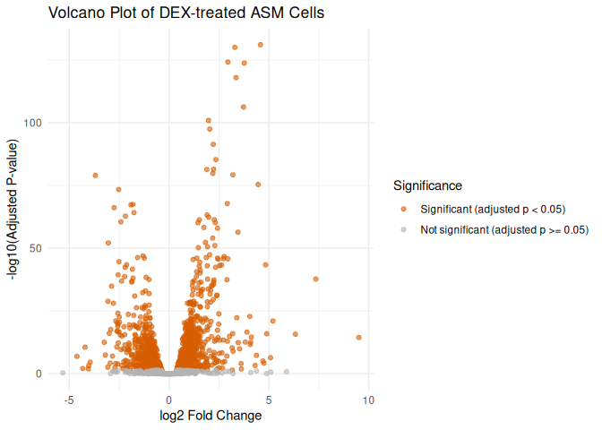

# Interactive Report: Airway Data

2026-03-05

## Background

Asthma is a chronic inflammatory respiratory disease affecting over 300
million people worldwide. Glucocorticoids (GCs) are a mainstay therapy
for asthma due to their anti-inflammatory effects in multiple lung
tissues, including the airway smooth muscle (ASM). GCs act by binding to
glucocorticoid receptors (GRs), which translocate to cell nuclei and
modulate transcription in a tissue-dependent manner. Despite their
widespread use, the mechanism by which GCs suppress inflammation
specifically in ASM remains poorly understood.

This report is based on the RNA-Seq transcriptome profiling study by
[Himes et al. (2014)](https://doi.org/10.1371/journal.pone.0099625),
which characterized transcriptomic changes in primary human ASM cell
lines treated with dexamethasone (DEX) — a potent synthetic
glucocorticoid — to better understand GC-induced gene expression changes
in the context of asthma.

## Methods

Four primary human ASM cell lines from white male donors were treated
with 1 µM dexamethasone or a control vehicle for 18 hours. RNA-Seq was
performed to profile transcriptomic changes. An average of 58.9 million
raw sequencing reads per sample were obtained and aligned to the hg19
human genome reference. Differential expression analysis was performed
using Cufflinks, with significance determined by a Benjamini-Hochberg
corrected p-value \< 0.05.

The dataset used in this report contains the top 2,000 differentially
expressed genes (by adjusted p-value) from this experiment.

## Results

                    X  symbol log2FoldChange        pvalue          padj
    1 ENSG00000152583 SPARCL1       4.574967 4.110667e-136 9.195151e-132
    2 ENSG00000165995  CACNB2       3.291099 4.463384e-135 9.984145e-131
    3 ENSG00000120129   DUSP1       2.947850 3.033840e-129 6.786396e-125
    4 ENSG00000101347  SAMHD1       3.767022 7.682657e-129 1.718534e-124
    5 ENSG00000189221    MAOA       3.353655 5.212706e-123 1.166030e-118
    6 ENSG00000211445    GPX3       3.730439 2.585059e-111 5.782519e-107

The RNA-Seq analysis identified **316 significantly differentially
expressed genes** in DEX-treated ASM cells. The top differentially
expressed genes included both well-characterized
glucocorticoid-responsive genes (e.g., *DUSP1*, *KLF15*, *PER1*,
*TSC22D3*) and less-investigated candidates (e.g., *C7*, *CCDC69*,
*CRISPLD2*).

The volcano plot below visualizes the relationship between fold-change
and statistical significance across genes. Points further right or left
indicate larger fold-changes, while points higher on the y-axis indicate
greater statistical significance.

## Discussion

A key finding of Himes et al. (2014) was the identification of
*CRISPLD2* (cysteine-rich secretory protein LCCL domain-containing 2) as
a novel glucocorticoid-responsive gene. *CRISPLD2* encodes a secreted
protein previously implicated in lung development and endotoxin
regulation. Notably:

- SNPs in *CRISPLD2* were nominally associated with inhaled
  corticosteroid (ICS) resistance and bronchodilator response in asthma
  patients from genome-wide association studies (GWAS).
- DEX treatment significantly increased *CRISPLD2* mRNA (~8-fold) and
  protein (~1.7-fold) expression in ASM cells.
- *CRISPLD2* expression was also induced by the proinflammatory cytokine
  IL1β.
- siRNA-mediated knockdown of *CRISPLD2* increased IL1β-induced *IL6*
  and *IL8* expression, suggesting *CRISPLD2* plays an anti-inflammatory
  role in ASM.

Gene set enrichment analysis of the 316 differentially expressed genes
revealed overrepresentation of functional categories including
glycoprotein/extracellular matrix, vasculature development, lung
development, regulation of cell migration, and extracellular matrix
organization — all relevant to asthma pathophysiology.

## Citation

Himes, Blanca E., Xiaofeng Jiang, Peter Wagner, Ruoxi Hu, Qiyu Wang,
Barbara Klanderman, Reid M. Whitaker, et al. 2014. “RNA-Seq
Transcriptome Profiling Identifies CRISPLD2 as a Glucocorticoid
Responsive Gene That Modulates Cytokine Function in Airway Smooth Muscle
Cells.” Edited by Jan Peter Tuckermann. PLoS ONE 9 (6): e99625.
https://doi.org/10.1371/journal.pone.0099625.

Posit deployment link: https://connect.posit.cloud/jess355/content/019ce49e-8268-8620-0dc8-3d881fc455d9?utm_source=publisher-positron

GitHub pages link: https://bifx547-26.github.io/airway-report-jess355/